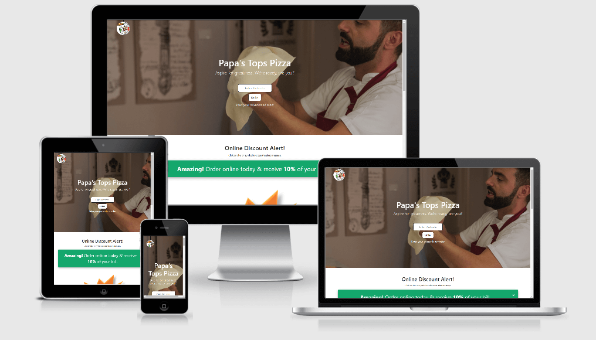

# New Papa's Tops Pizza

***
[Direct link to GitHub Repo](https://github.com/Spagettileg/new-papas-tops-pizza)

[Direct link to Live Project](https://spagettileg.github.io/new-papas-tops-pizza/) 

***

This project is designed to showcase a front end design built with the following 

 - [HTML](https://html.spec.whatwg.org/multipage/) | [Bootstrap](https://www.bootstrapcdn.com/) | [CSS](https://www.w3.org/Style/CSS/) | [jQuery](https://jquery.com/)

***

Papa's Tops Pizza has requested for an overhaul of their current website as they want to embrace some of the latest UX design and ensure the website has a modern feel where the users will enjoy a better shopping experience.  

Whilst pizza will remain as the core product for sale, it's clear in todays highly competetive market place that the business owner needs to improve their marketing and deal proposition to the end user. Whilst a quality pizza product is a given, the user wants to be delighted with deals that generates a feeling of good value.   Whats not to like about whiskey? This website is built for the whiskey connoisseur who enjoys the finer things in life, like minded consumers give their feedback on premium products and opportunities to purchase whiskey at discounted prices.

The user experience centres upon signing up to an incentive based web design and the user is able to click on link buttons to access more feature information, special membership and rapid ordering through auto-mated dialling or email ordering. 

***

## Table of Contents

1. [UXD Considerations](#uxd-considerations)
    * [User & Business Objectives](#user-&-business-objectives) 
    * [Wireframes](#wireframes)
    * [User Stories](#user-stories)
    * [CSS Framework](#css-framework)
    * [Colour Palette](#colour-palette)
    * [Typography](#typography)
    * [Icon Graphics](#icon-graphics)
    * [Navbar Design](#navbar-design)

2. [Technologies Applied](#technologies-applied)
    * [Languages](#languages)
    * [Libraries](#libraries)
    * [Tools](#tools)

3. [Features](#features)
    * [Features Left To Implement](#features-left-to-implement) 

4. [Tests](#tests)
    * [Compatibility](#compatibility)
    * [Test Observations](#test-observations)

5. [Deployment](#deployment)
    * [How to run this project locally](#how-to-run-this-project-locally) 

6. [Credits](#credits)
    * [Content](#content)
    * [Media](#media)
    * [Acknowledgements](#acknowledgements)

## UXD Considerations

### User & Business Objectives

#### User
- The user belongs to a community of pizza enthusiasts
- Great product offerings and guidance upon a broad range of pizza products made available- 
- Access to well known and lesser known pizza products to help expand the users range and appetite
- Ease of ordering, preferably via website or telephone 
- Quick access to meal deals with clear information of cost savings

#### Business
- Promotion of latest pizza products to generate customer demand 
- Market new meal deal offerings to help leverage customer interest 
- Access required to customer details for efficient payment & delivery of pizza products
- Offering free products as part of the meal deal to build customer trust, goodwill and the impression that value for money is being created  
- Social media link access to further promote Papa's Tops Pizza and encourage member intra-communications

#### Next Stage Generation
- Increase product density through expanding scope of products and other italian food products for the ultimate italian dining experience  
- Leverage footfall data to attract commercial online advertising, with resultant revenues used to maintain and grow website
- Affiliate with italian food product merchants to encourage exclusivity on new products  
- Explore new social media channels to promote 'Papa's Tops Pizza'

### Wireframes
My wireframe mock-up design have been created in [Balsamiq](https://balsamiq.com/) to showcase the 'New Papa's Tops Pizza' website responsiveness on mobile, tablet and desktop devices.

•	[Papa's Tops Pizza](https://github.com/Spagettileg/new-papas-tops-pizza/blob/main/wireframes/papas-tops-pizza_final.zip)

### User Stories
* New website to incorporate nice imagery
* Avoid a 'boxy layout' design 
* Promote some meal deals and mention an online ordering discount   
* Include links to the company's Facebook & Twitter pages
* A slide show featuring pizza products with good & clear imagery 
* Clear view of where a postcode can be added to initiate the ordering process
* Navbar design to include links to other webpages such as 'Menu & Ordering', 'Members' and 'Contact Us'
* Company phone number must feature, although this should be discreet
* Must include the web agency corporate logo in the footer design

### CSS Framework
Bootstrap was the chosen framework for styling my project. I used the Bootstrap grid extensively to support responsiveness on mobile, tablet and desktop devices. 

### Colour Palette
Colours used in this project were sourced from [visme.co](https://visme.co/blog/website-color-schemes/). Essentially, the colours are seeking to capture key attributes of Papa's Tops Pizza through fresh, appetising, full flavour and wholesome

Colour             | Hex Code
-------------------|----------
Rich Black         | `#0e1116`
Cloud Grey         | `#747474`
Charcoal Grey      | `#343A40`
Satsuma Orange     | `#FF652F`
Buttercup Yellow   | `#FFE400`
Watercress Green   | `#14A76C`
White              | `#FFFFFF`
Grey               | `#BFBFBF`
Off-White          | `#FAFAFA`

### Typography
[Nunito](https://fonts.google.com/) and [sans-serif](https://fonts.google.com/) fonts were used throughout this project.

### Icon Graphics
Font Awesome 5 icon graphics were used in conjunction with Bootstrap 4, primarily to support the features section, as viewed in `index.html` page 

Page                   | Function                  | Font  
-----------------------|---------------------------|-------
index.html             | Home link                 | `fas fa-home`
index.html             | Menu & Ordering           | `fas fa-pizza-slice` 
index.html             | Members                   | `fas fa-user-friends`
index.html             | Contact Us                | `fas fa-phone-alt`
index.html             | Footer - Social Media     | `fab fa-facebook-square`    
index.html             | Footer - Social Media     | `fab fa-twitter-square`
index.html             | Footer - Finance          | `fab fa-cc-visa`
index.html             | Footer - Finance          | `fab fa-cc-mastercard`
index.html             | Footer - Finance          | `fas fa-credit-card`
index.html             | Footer - Finance          | `far fa-credit-card`
index.html             | Footer - Finance          | `fab fa-cc-jcb`

### Navbar Design
For all device viewpoints, the navbar offers 4 functions on show. The navbar has been designed to both collapse and open on all devices / viewpoints via a Javascript toggle control  

- Home
- Menu & Ordering
- Members - Includes a modal window to allow user to register as a member
- Contact Us - Includes a modal window to provide the user with contact information 

## Technologies Applied

### Languages
•	[HTML](https://html.spec.whatwg.org/multipage/) used as the markup language

•	[CSS](https://www.w3.org/Style/CSS/) used to style the HTML

•   [JavaScript](https://developer.mozilla.org/en-US/docs/Web/JavaScript) used mostly for DOM manipulation

### Libraries
•	[Bootstrap](https://www.bootstrapcdn.com/) used to enable styling of front page and support aesthetic design

•	[jQuery](https://jquery.com/) used The integrity and crossorigin attributes are used for Subresource Integrity (SRI) checking. This allows browsers to ensure that resources hosted on third-party servers have not been tampered with 

•	[Font Awesome](https://fontawesome.com/) to provide the font icons for Papa's Tops Pizza website

### Tools
•	[AWS Cloud9](https://aws.amazon.com/cloud9/) a cloud-based integrated development environment (IDE) that lets you write, run, and debug your code with just a browser

•	[Balsamiq](https://balsamiq.com/) is a small graphical tool to sketch out user interfaces, for websites and web / desktop / mobile applications and used to visualise my project through mock-up design

•	[Git](https://git-scm.com/) is a free and open source distributed version control system designed to handle everything from small to very large projects with speed and efficiency

•	[Jigsaw - CSS validation](https://jigsaw.w3.org/css-validator/) this validator checks the markup validity of CSS style sheet and ensure coding convention is upheld

•	[JS Hint](https://jshint.com/) a tool that helps to detect errors and potential problems in the javascript code

•	[W3C - HTML validation](https://validator.w3.org/) this validator checks the markup validity of HTML web documents

### Hosting
•	[GitHub](https://github.com/) is a code hosting platform for version control and collaboration. It lets you and others work together on projects from anywhere

## Features

### index.html
**Navbar** has been designed to include an icon image that can be toggled to both reveal and close the navbar. The 'home' icon allows the user to return to the homepage / top of the screen. In addition, the 'menu & ordering' icon is a placeholder for the next phase of developemnt to connect the user to the full pizza menu, with capability to order. 'Member' icon provide a portal to a modal window to enable user to complete a standard form for company membership & benefits. 'Contact Us' icon is another portal to a modal window that enables the user view the companies location, address, telephone number, email address and opening hours. Furthermore, the user is able to call & email the company direct from this app modal window  

A hero image of a pizza chef greets the user with an invitation to enter their postcode & click the **order** button to initiate the ordering process      

Online discount notification **10% of the bill** appears in thenext container. This message can be closed by clicking an 'x' icon 

**Meal Deals** helps the company advertise their discounts on certain meal combinations. Circular images are animated for improved UI 

**Carousel** of current pizza product offerings are on view. Three circular pizza images appear per carousel cycle with a progress indicator to show the user where they are in the animation cycle    

**Footer** is built into three specific segments:

1. **Pizza Topping** links different food genre toppings including meat, chicken, vegetable, plain - no fuss and customise
2. **Social media** links and fonts secured from bootstrap / font awesome5. The links are wired to Papa's Tops Pizza' social media sites for Facebook & Twitter. Again, the .hover pseudo class has been used to provide a transition scale increase of 15%
3. **Site Links** links allow the user to access menu & ordering, members & contact us. Web agency logo is on view. The lower footer presents a series of accepted credit cards that can be used to pay for an order. Finally, Papa's Tops Pizza' current year of trading, powered by Javascript, copyright and web designer information are also on view.    

### Features left to implement
-	Add registration and user authentication to protect website from accidental or malicious attack 
-	Create a product ordering and payments process (inc shopping cart) to enable users to purchase products  
    -	Link for product orders to a `postgreSQL` database with `Stripe` payment functionality
-	Add a web hit counter to understand popularity of website
-	Create a member feedback / blog function to help promote continuous improvement of UXD (User Experience Design) for user enjoyment and UCD (User Centred Design) to create great products 
-   Product search function to be create to help user quickly find pizza products of their choosing 
-   Add full pizza product menu and connect to Navbar 

## Tests
A user [testing matrix](https://github.com/Spagettileg/new-papas-tops-pizza/blob/main/testing/UserTestingPapasTopsPizzav1final.zip) has been produced in MS Excel, but saved as .pdf to visualize here on GitHub. It outlines the various tests I made to ensure the site renders consistently across different platforms, and that each functionality behaves as intended.

### Compatibility
The following browsers were used in testing the New Papa's Tops Pizza application. Internet Explorer was out of scope for testing due to obsolete capability

platform | version
---------|--------
Chrome   |86.0.4240.198
Edge     |86.0.622.69
Firefox  |78.0.2
Safari   |14.1
Opera    |72.0.3815.320

### Test Observations
The following media queries were added to improve the project responsiveness on all tested devices.

Media Query                  | Device  | Class                    | Comments
-----------------------------|---------|--------------------------|-------------
max-width 375px & portrait   | Mobile  | `.navbar`                | `height: 18rem`, `top: -18rem`
max-width 375px & portrait   | Mobile  | `.menu`                  | `top: 2rem`. `width: 3.5rem`, `height: 3.5rem`
max-width 375px & portrait   | Mobile  | `.menu.change`           | `top: 20rem` 
max-width 375px & portrait   | Mobile  | `.menu::before`          | `height: 20rem`, `top: -20rem`
max-width 375px & portrait   | Mobile  | `.navbar-link`           | `margin: 0 1.5rem`
max-width 375px & portrait   | Mobile  | `.navbar-link i`         | `font-size: 1.5rem`
max-width 375px & portrait   | Mobile  | `.navbar-link span`      | `font-size: 1.25rem`
max-width 375px & portrait   | Mobile  | `.deal-gallery`          | `margin: 0`
max-width 375px & portrait   | Mobile  | `.alert`                 | `font-size: 1rem`
max-width 667px & landscape  | Tablet  | `.navbar-link`           | `margin: 0 0.75rem`
max-width 667px & landscape  | Tablet  | `.navbar-link i`         | `font-size: 2rem`
max-width 667px & landscape  | Tablet  | `.navbar-link span`      | `font-size: 1.1rem`
max-width 667px & landscape  | Tablet  | `.carousel-inner img`    | `max-height: 8rem`, `max-width: 8rem`, `padding: 1.1rem`
max-width 667px & landscape  | Tablet  | `.carousel-item p`       | `width: 18rem`
min-width 700px & portrait   | Desktop | `.carousel-inner img`    | `max-height: 8rem`, `max-width: 8rem`, `padding: 1.1rem`
max-width 700px & portrait   | Desktop | `.carousel-item p`       | `width: 18rem`
max-width 768px & portrait   | Tablet  | `.navbar-link`           | `margin: 0 0.75rem`
max-width 768px & portrait   | Tablet  | `.navbar-link i`         | `font-size: 2.5rem`
max-width 768px & portrait   | Tablet  | `.navbar-link span`      | `font-size: 1.3rem`
max-width 768px & portrait   | Tablet  | `.carousel-inner img`    | `max-height: 10rem`, `max-width: 10rem`, `padding: 1.1rem`
max-width 768px & portrait   | Tablet  | `.carousel-item p`       | `width: 18rem`
max-width 1024px & portrait  | Desktop | `.navbar-link`           | `margin: 1.25rem`
max-width 1024px & portrait  | Desktop | `.navbar-link i`         | `font-size: 3rem`
max-width 1024px & portrait  | Desktop | `.navbar-link span`      | `font-size: 1.5rem`
max-width 1024px & portrait  | Desktop | `.deal-gallery`          | `margin: 1.25rem`
max-width 1024px & portrait  | Desktop | `.menu`                  | `left: 1.25rem`

## Deployment

### How to run this project locally

## Credits

### Content

### Media

### Acknowledgements

